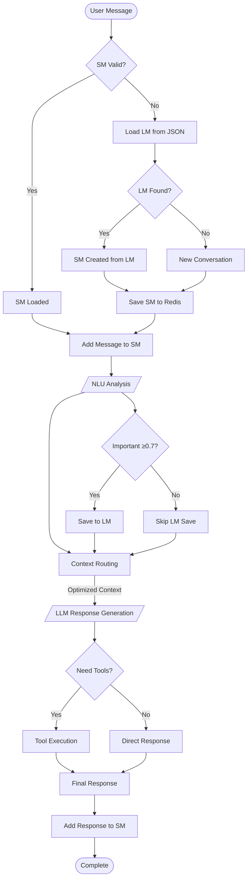

```mermaid
flowchart TD
    Start([User Message]) --> CheckSM{SM Valid?}

    CheckSM -->|Yes| LoadSM[SM Loaded]
    CheckSM -->|No| LoadLM[Load LM from JSON]

    LoadSM --> AddMessage[Add Message to SM]

    LoadLM --> CreateSM{LM Found?}
    CreateSM -->|Yes| NewSM[SM Created from LM]
    CreateSM -->|No| NewConv[New Conversation]

    NewSM --> SaveSM[Save SM to Redis]
    NewConv --> SaveSM

    SaveSM --> AddMessage

    AddMessage --> NLUAnalysis[/NLU Analysis/]

    NLUAnalysis --> ContextRoute[Context Routing]
    NLUAnalysis --> CheckImportance{Important ≥0.7?}

    CheckImportance -->|Yes| SaveLM[Save to LM]
    CheckImportance -->|No| SkipLM[Skip LM Save]

    SaveLM --> ContextRoute
    SkipLM --> ContextRoute

    ContextRoute --> |Optimized Context| ResponseLLM[/LLM Response Generation/]
    
    ResponseLLM --> ToolDecision{Need Tools?}

    ToolDecision -->|Yes| ToolCall[Tool Execution]
    ToolDecision -->|No| DirectResponse[Direct Response]

    ToolCall --> FinalResponse[Final Response]
    DirectResponse --> FinalResponse

    FinalResponse --> AddResponse[Add Response to SM]
    AddResponse --> Complete([Complete])
```